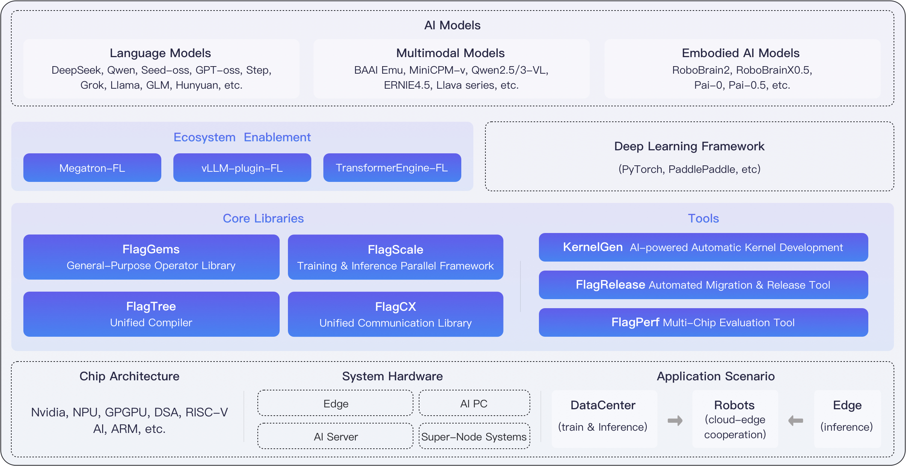

# FlagOS Overview

FlagOS is a unified, open-source system software stack designed for a variety of AI chips.

## Composition modules of FlagOS

The figure below shows the position of FlagOS in the AI ecosystem and its composition modules.

FlagOS comprises four core modules: the operator library FlagGems, the compiler FlagTree, the communication library FlagCX, and the parallel framework FlagScale; and three open-source tools: FlagPerf, FlagRelease, and Triton-Copilot.

### Core modules

- **FlagGems**

FlagGems is a high-performance general-purpose operator library implemented with the Triton programming language and its extended languages. FlagGems is designed to provide a suite of general-purpose operators for large models, accelerating the inference and training of models across multiple backend platforms.

- **FlagTree**

FlagTree is an open-source, unified compiler for multiple AI chips. FlagTree is dedicated to building a compiler and associated tooling platform for diverse AI chips, advancing and expanding the upstream and downstream Triton ecosystem, with the goals of supporting existing adaptation solutions, unifying code repositories, and enabling rapid multi-backend support from a single repository. For upstream model users, FlagTree provides unified compilation support across multiple backends; for downstream chip vendors, FlagTree offers reference implementations for integration into the Triton ecosystem.

- **FlagScale**
  
FlagScale is a comprehensive toolkit designed to support the entire lifecycle of large models. FlagScale builds on the strengths of several prominent open-source projects, including Megatron-LM and vLLM, to provide a robust, end-to-end solution for managing and scaling large models.

- **FlagCX**

FlagCX is a scalable and adaptive unified communication library for cross-chip environments. FlagCX delivers high-performance point-to-point and collective communication capabilities tailored for multi-chip, multi-platform scenarios. By leveraging the native collective communication capabilities of each platform, FlagCX incorporates technologies such as device-buffer IPC and RDMA to enable highly efficient collective communication in both cross-chip and single-chip scenarios, while also providing adaptive tuning capabilities for communication optimization.

### Open-source tools

- **KernelGen**
KernelGen is an operator auto-generation tool. KernelGen is designed to construct operator definitions through natural language prompts, retrieve existing similar operator definitions, automatically execute operator accuracy and performance testing, generate accuracy and performance test results, and produce Triton Kernels.

- **FlagRelease**
FlagRelease is a platform dedicated to the automatic migration, adaptation and release of large models for multi-architecture AI chips. FlagRelease aims to enable mainstream large models to be migrated, validated, and released on diverse domestic AI hardware with lower cost and higher efficiency through automated, standardized, and intelligent adaptation workflows.

- **FlagPerf**
FlagPerf is an integrated AI hardware evaluation engine. FlagPerf aims to establish an industry practice-oriented indicator system and evaluate the actual performance of AI hardware under combinations of software stacks (model + framework + compiler).

## Capabilities and advantages of FlagOS

Below are the capabilities and advantages of FlagOS:

- Over 20 chip types support and PyTorch and PaddlePaddle support

  - FlagGEMs supports over 200 core operators.
  - The unified compiler FlagTree supports chips from 12 vendors.
  - FlagScale framework enables true cross-framework, cross-chip, and cross-backend unification.
  - The unified communication library FlagCX supports five communication protocols.

- AI-powered automation and development efficiency

  - KernelGen supports end-to-end operator generation, verification, and optimization across multiple chip backends.
  - FlagRelease supports continuous deployment of mainstream open-source models on 11 chip types, with automated migration accelerated by FlagOS + AI agents.

- Full-stack performance enhancement

  - Achieves end-to-end inference performance leap, achieves higher speedups than native Triton on key models, approaching the peak performance of CUDA.
  - FlagScale auto-tuning automatically accelerates both training and inference.
  - The FlagCX communication library supports pipeline optimization for accelerated performance.

- Broader architecture, system, and scenario coverage

  - Supports more model architectures. Beyond Transformers model, and also supports RWKV and Diffusion-family models.
  - Supports more system architectures. Compatible with emerging hyperscale node architectures such as Inspur and Hygon.
  - Supports full-stack embodied intelligence: Covers the entire pipeline—from pre-training and post-training to quantized inference—for “brain” and “cerebellum” (VLA) models, including edge-cloud collaboration and tool retrieval.
